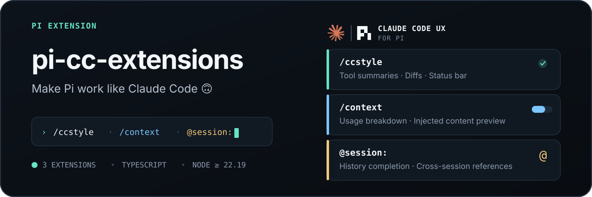

<p align="center">
  
</p>

<p align="center">
  <a href="https://pi.dev/packages?name=pi-cc-extensions"></a>
  <a href="https://www.npmjs.com/package/pi-cc-extensions"></a>
  <a href="#compatibility"></a>
  <a href="./extensions"></a>
</p>

<p align="center">
  Claude Code-style output, context inspection, and Agent / Session references.
</p>

<p align="center">
  <a href="./README.md">简体中文</a> · <strong>English</strong>
</p>

---

## Preview

<table>
  
</table>

## Quick start

```bash
pi install npm:pi-cc-extensions

# GitHub
pi install git:github.com/minuque/pi-cc-extensions
```

Run `/reload` after installation.

## Features


| Feature                      | Description                                                                                                                                       | Entry point |
| ------------------------------ | --------------------------------------------------------------------------------------------------------------------------------------------------- | ------------- |
| Claude Code-style output     | Tool summaries, expand/collapse, rich edit/write diffs, and`on` / `compact` / `off` modes                                                         | `/ccstyle`  |
| Fullscreen mouse interaction | Tool card/group click-to-toggle, previews, hover highlight, and a back-to-bottom button | `TUIMODE=fullscreen` or `--tui-mode fullscreen` |
| Settings panel               | `Style / Diff / Thinking / Feature` tabs: startup header toggle and wheel step                                                                    | `/ccstyle`  |
| Context inspection           | Usage breakdown and previews for the system prompt, tools, skills, and messages                                                                   | `/context`  |
| Session references           | Search and inject effective context from previous Sessions or existing SubAgents                                                                  | `@session:` |
| Theme                        | Bundled CC Dark and CC Light themes                                                                                                               | `/theme`    |

## Configuration

`/ccstyle` behavior is configured through `~/.pi/agent/claude-code-style.json`:

```js
{
  "mode": "on",                            // on: Claude Code style; compact: one-line summaries; off: Pi native rendering
  "excludeRenderers": [],                  // exact tool names that keep their native renderer; Agent always keeps its dedicated renderer
  "diffViewMode": "auto",                  // diff layout: auto / split / unified
  "diffIndicatorMode": "bars",             // diff change indicators: bars / classic / none
  "diffSplitMinWidth": 120,                // min terminal width before auto layout uses side-by-side columns
  "diffCollapsedLines": 24,                // diff body lines shown when collapsed; beyond that shows the expand hint (Ctrl+O / click)
  "diffWordWrap": true,                    // whether long diff lines wrap (otherwise truncated)
  "expandedPreviewMaxLines": 40,           // max body lines for expanded output/diff
  "useSummaryTitlesAsThinkingTitle": true, // use the latest provider summary as the active thinking title
  "previewLines": 3,                       // thinking preview lines; 0 hides the preview body
  "animationIntervalMs": 90,               // thinking title animation interval in ms
  "showStartupHeader": true,               // custom startup header (logo + tips) toggle
  "scrollStepLines": 3                     // fullscreen mouse wheel scroll lines
}
```

## Local development

```bash
npm test
npm run typecheck
./test.bat # or pi -e .
```

Run `/reload` after changing extensions.

## Compatibility

- Node.js `>=22.19.0`, Pi `^0.84.0` (loaded through `pi.extensions` and `pi.themes` in the root `package.json`)

## Recommended companions


| Extension                                | Purpose                                                      |
| ------------------------------------------ | -------------------------------------------------------------- |
| `npm:@tintinweb/pi-subagents`            | Parallel SubAgents, background tasks, and worktree isolation |
| `npm:@tintinweb/pi-tasks`                | Claude Code-style task tracking and coordination             |
| `npm:pi-mcp-adapter`                     | On-demand MCP tool discovery with lower context usage        |
| `npm:@ff-labs/pi-fff`                    | FFF-powered fuzzy file and content search (fffind / ffgrep)  |
| `npm:pi-web-access`                      | Web search, URL fetching, GitHub cloning, PDF/video parsing  |
| `npm:pi-theme-picker`                    | Theme search and live preview                                |
| `npm:@narumitw/pi-usage`                 | Current-account usage for Codex / Copilot / OpenRouter       |
| `git:github.com/DietrichGebert/ponytail` | Lazy-mode coding: forces the simplest working solution       |

## Credits

- Rich diffs are adapted from [`MasuRii/pi-tool-display`](https://github.com/MasuRii/pi-tool-display) (MIT). See [`extensions/renderer/tool/diff/ATTRIBUTION.md`](./extensions/renderer/tool/diff/ATTRIBUTION.md).
